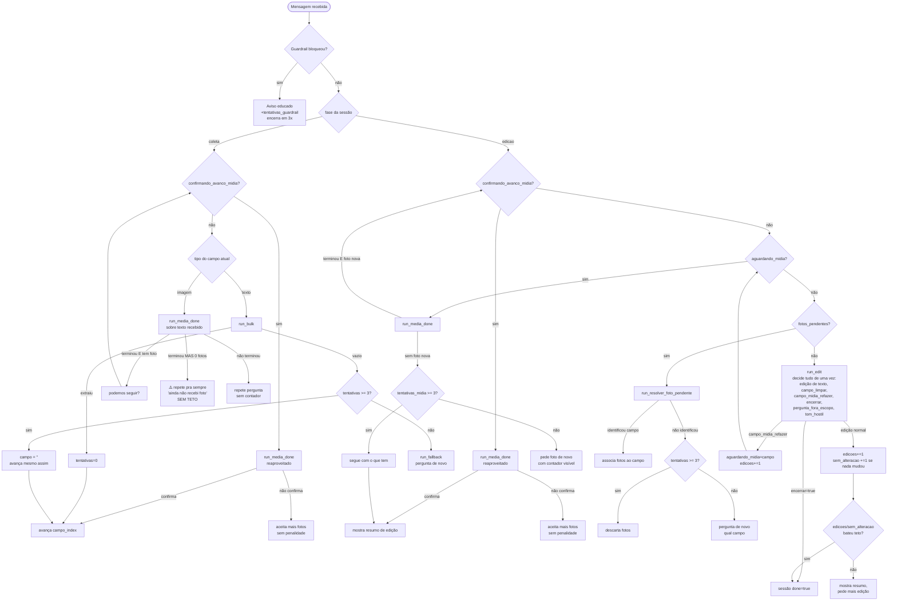

# Como o router funciona hoje

Mapa completo do fluxo de conversa, campo a campo, pra servir de base pra discutir a reestruturação. Não é um diagrama do "código", é do **comportamento observável** — cada caixa é uma decisão real que acontece hoje em [conversation.py](src/conversation.py) e [schemas.py](src/schemas.py).

## Princípio geral (não mudou)

O router é uma **máquina de estados determinística**, não um agente livre. O LLM nunca decide "o que fazer a seguir" — ele só extrai/classifica dentro de um schema fixo (`.output(SCHEMA)`), sempre chamado por trás de um guardrail. Quem decide o próximo estado é sempre código Python puro, olhando pros campos da `Session`.

Isso significa: todo "bug de comportamento estranho" tem uma explicação determinística em algum `if` — não é o modelo "indo por um caminho errado" no sentido de um agente. É importante manter esse mapa em mente ao redesenhar, porque a próxria arquitetura (estado explícito) é o que torna isso rastreável.

## Estado da sessão (campos relevantes pro roteamento)

| Campo | Tipo | Papel |
|---|---|---|
| `fase` | `"coleta"` \| `"edicao"` | qual das duas funções trata a mensagem |
| `campo_index` | int | em que campo da lista `_CAMPOS` a coleta está |
| `tentativas` | int | tentativas sem resposta válida pro campo de texto **atual** (não é por campo, é um contador que só reseta ao avançar) |
| `aguardando_midia` | str\|None | campo de mídia em processo de **refazer** (só existe na fase edição) |
| `midia_substituindo` | bool | true até a 1ª foto nova chegar durante um refazer (protege contra confirmar sem enviar nada novo) |
| `confirmando_avanco_midia` | str\|None | campo de mídia aguardando a pergunta "podemos seguir?" ser respondida |
| `tentativas_midia` | int | tentativas sem foto nova durante um refazer -- **só existe no fluxo de edição**, não na coleta inicial |
| `fotos_pendentes` | list | fotos recebidas na edição sem saber a qual campo pertencem |
| `edicoes` / `sem_alteracao` | int | orçamento de chamadas na fase de edição |
| `changelog_edicao` | list | log "campo: antes -> depois", contexto pro LLM em vez de transcrição bruta |

## Pontos de entrada (server.py)

Toda mensagem chega por `/webhook` (WhatsApp real), `/message` (Streamlit) ou `/audio`, todas convergindo pra dois métodos de `Session`:

- **Texto/áudio transcrito** → `Session.step(text)` → despacha pra `mensagem_coleta` ou `mensagem_edicao` conforme `fase`.
- **Imagem/documento-imagem** → `Session.registrar_imagem(caminho, sha256)` → lógica própria, **não passa pelo LLM**.

## Fase 1 — Coleta (`mensagem_coleta`)

Percorre `_CAMPOS` em ordem fixa (`description` → `student_count` → `fotos_alunos` → `folha_chamada`). Dentro de cada campo, o comportamento depende do `tipo`:

**Campo de texto** (`run_bulk` primeiro, `run_fallback` se vazio):
1. Chama `run_bulk` com a mensagem atual + campos já respondidos como contexto.
2. Se extraiu valor → limpa `tentativas`, avança campo (`_avancar_campo`).
3. Se não extraiu → `tentativas += 1`. Em 3 tentativas, **desiste e segue em branco** (saída garantida). Antes disso, chama `run_fallback` pra gerar uma pergunta de esclarecimento.

**Campo de imagem** (`run_media_done` sobre qualquer texto recebido durante a etapa):
1. Fotos chegam via `registrar_imagem`, sempre silenciosas (sem LLM, sem resposta por foto).
2. Um texto do usuário durante essa etapa é classificado como "terminei" ou não.
3. Se "terminei" **e já tem pelo menos 1 foto** → pergunta "podemos seguir?" (`confirmando_avanco_midia`).
4. Se "terminei" **mas 0 fotos** → ⚠️ **sem saída**: repete "ainda não recebi nenhuma foto" pra sempre, não importa quantas vezes o usuário confirme. (achado da análise de log, ver `ACHADOS` no fim)
5. Se não "terminei" → repete a pergunta de mídia, sem contador de tentativas nessa etapa.

**Confirmação de avanço** (`confirmando_avanco_midia` setado): próxima mensagem passa por `_tratar_confirmacao_avanco_midia`, que roda `run_media_done` de novo (reaproveitado) só pra decidir sim/não. Se "sim" → avança de fato; se "não" → volta a aceitar mais fotos, sem penalidade.

## Fase 2 — Edição (`mensagem_edicao`)

Quatro sub-estados, checados **nessa ordem de prioridade**:

1. **`confirmando_avanco_midia`** setado → mesma lógica de confirmação da coleta, só que ao confirmar mostra o resumo de edição em vez de avançar campo.
2. **`aguardando_midia`** setado (pedido de refazer mídia em andamento) → aceita fotos novas, com **`tentativas_midia`, com teto (`MAX_TENTATIVAS_MIDIA=3`)** — essa etapa TEM saída de emergência, ao contrário da coleta inicial. Ao confirmar (com pelo menos 1 foto nova), entra em `confirmando_avanco_midia`.
3. **`fotos_pendentes`** não vazio (fotos que chegaram sem contexto claro) → pergunta a qual campo pertencem, via `run_resolver_foto_pendente`, com teto de tentativas antes de descartar.
4. **Nenhum dos acima** → fluxo principal: `run_edit` sobre o `json_model` atual + `changelog_edicao`. Um único LLM decide simultaneamente: edição de campo de texto, `campo_limpar`, `campo_midia_refazer`, `pergunta_fora_escopo`, `tom_hostil`, `encerrar`. `edicoes` incrementa em **toda** mensagem que passa por aqui (mesmo sem mudança real), com teto `MAX_EDICOES=5`; `sem_alteracao` incrementa só quando nada muda, com teto `MAX_SEM_ALTERACAO=3`.

## Guardrail (transversal, não é uma etapa)

Toda chamada de LLM (das 5 funções em `extraction.py`) passa primeiro por uma checagem de guardrail (`new_call().guardrail(...)`), que só bloqueia tentativas genuínas de manipulação (revelar prompt, trocar de persona, exploit). Se bloquear, a sessão recebe um aviso e conta pra `tentativas_guardrail` (`MAX_TENTATIVAS_GUARDRAIL=3`), encerrando a sessão em caso de reincidência.

---

## Fluxograma

---

## Achados concretos (da análise do log do Eduardo Pane)

1. **Sem saída de emergência em campo de mídia na coleta inicial.** Se o usuário genuinamente não tem foto pra um campo (ex: "não deu tempo de tirar foto da chamada"), a coleta **nunca deixa passar em branco** — ao contrário dos campos de texto (que desistem em 3 tentativas) e do fluxo de refazer na edição (que tem `MAX_TENTATIVAS_MIDIA`). É a única etapa sem teto algum. Foi isso que prendeu o Eduardo num loop de ~6 mensagens até ele ficar hostil.
2. **`concluiu_envio` às vezes falha em confirmações diretas** ("Sim" puro, sem gíria) — pode ser característica do modelo atual (você mencionou trocar de modelo pra resolver isso).
3. **`tentativas` (texto) é um contador único, não por campo** — já foi corrigido nesta sessão pra resetar ao trocar de campo, mas vale lembrar que é um único contador acumulado dentro do mesmo campo, não "3 chances genuínas" se o usuário mudar de assunto no meio.

Esses três pontos, mais o pedido de reestruturar "como o router chama cada etapa", são um bom ponto de partida pra próxima conversa de design.
